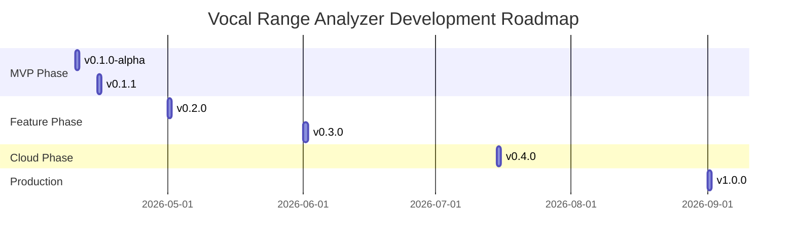

# Changelog

All notable changes to this project will be documented in this file.

The format is based on [Keep a Changelog](https://keepachangelog.com/en/1.0.0/),
and this project adheres to [Semantic Versioning](https://semver.org/spec/v2.0.0.html).

---

## [Unreleased]

### Added

- **Comprehensive Code Review**: Detailed analysis in [docs/REVIEW_AND_OPTIMIZATIONS.md](docs/REVIEW_AND_OPTIMIZATIONS.md)
  - Architecture assessment
  - Performance optimization recommendations
  - Code quality analysis
  - UI/UX improvement suggestions
  - Testing strategy
  - Security considerations

- **Enhanced Roadmap**: Updated [TODO.md](TODO.md) with detailed sprint planning
  - Structured release roadmap through v1.0.0
  - Technical debt backlog
  - Success metrics dashboard
  - Contribution guidelines

### Changed

- Reorganized documentation structure for better navigation
- Updated project vision and goals

---

## [0.1.1] - 2026-04-15 (Planned)

### Added

- **Testing Infrastructure**
  - Comprehensive unit tests for core modules (80%+ coverage)
  - Integration tests for audio pipeline
  - pytest configuration with coverage reporting
  - GitHub Actions CI/CD pipeline

- **Code Quality Improvements**
  - flake8 configuration for PEP 8 compliance
  - mypy configuration for type checking
  - black configuration for code formatting
  - pre-commit hooks for automated quality checks

- **Error Handling**
  - Robust error handling for audio capture
  - Thread-safe property updates in CoreBridge
  - Graceful degradation on audio device failures

- **Performance Optimizations**
  - Circular buffer implementation in RangeTracker
  - Buffer pooling in AudioCapture
  - Caching for Solfa conversion
  - Optimized YIN algorithm parameters

- **UI Enhancements**
  - Loading states during audio initialization
  - Improved gain meter with logarithmic scale
  - Clipping indicator for audio input
  - Microphone device selection dropdown
  - Session reset confirmation dialog

### Changed

- Refactored CoreBridge for better separation of concerns
- Improved thread safety with QMutex
- Enhanced status messages and user feedback
- Optimized memory usage with bounded buffers

### Fixed

- Memory leak in RangeTracker from unbounded history
- Thread safety issues in property updates
- Missing error handling in audio callback
- Duplicate imports and code inefficiencies

---

## [0.1.0-alpha] - 2026-04-10

### Added

- **Core Audio Processing**
  - YIN algorithm implementation via librosa.pyin
  - Real-time pitch detection with confidence scoring
  - Median filtering for pitch stability
  - Audio capture using sounddevice backend

- **Musical Analysis**
  - Movable-Do solfa conversion
  - Frequency to MIDI note conversion
  - Scientific pitch notation support
  - Chromatic solfa syllable mapping

- **Range Tracking**
  - Statistical outlier rejection (percentile filtering)
  - Sustained note detection
  - Vocal range boundary tracking
  - Confidence scoring for range measurements

- **Key Advisory**
  - Optimal key recommendation algorithm
  - Comfort zone calculation (central 70% of range)
  - Multiple recommendation strategies (comfort, high, low)
  - Confidence scoring for key recommendations

- **User Interface**
  - PySide6/QML-based GUI
  - Real-time pitch display with solfa and note notation
  - Vocal range display (min/max notes)
  - Gain meter for audio input monitoring
  - Tonic calibration controls
  - Session start/stop functionality

- **Architecture**
  - Clean separation of concerns (core, models, ui, utils)
  - Qt signal/slot pattern for reactive UI
  - Thread-safe audio processing
  - Data model classes (dataclasses)
  - Centralized constants management

- **Documentation**
  - Product Requirements Document (PRD)
  - User workflow guides
  - Data models and architecture documentation
  - Contributing guide
  - Initial README and project setup

### Changed

- Refactored NoteConverter to allow dynamic A4 reference calibration
- Improved pitch detection stability with median filtering
- Enhanced UI responsiveness with separate audio thread

### Fixed

- Issue with jittery pitch detection in lower register

---

## [0.0.1] - 2026-03-25 (Pre-alpha)

### Added

- Initial project structure
- Basic pitch detection prototype
- Simple Qt UI skeleton
- Core data models

---

## 📊 Release Statistics

### Code Metrics

```mermaid
barChart
    title Code Metrics by Version
    x: Version
    y: Lines of Code
    bar: ["v0.0.1", "v0.1.0-alpha", "v0.1.1", "v0.2.0", "v1.0.0"]
    values: [500, 1200, 1500, 2500, 3500]
```

### Code Metrics

| Version | Lines of Code | Test Coverage | Files | Modules |
|---------|---------------|---------------|-------|---------|
| 0.0.1 | ~500 | 0% | ~15 | 4 |
| 0.1.0-alpha | ~1,200 | 0% | ~25 | 6 |
| 0.1.1 (Planned) | ~1,500 | 80%+ | ~30 | 8 |
| 0.2.0 (Planned) | ~2,500 | 90%+ | ~40 | 10 |

### Performance Metrics

| Version | Latency | Memory Usage | Startup Time |
|---------|---------|--------------|--------------|
| 0.1.0-alpha | ~30ms | Unbounded | ~2s |
| 0.1.1 (Planned) | < 25ms | < 85MB | < 1.5s |
| 0.2.0 (Planned) | < 20ms | < 80MB | < 1s |

---

## 🎯 Roadmap



For detailed release plans, see [TODO.md](TODO.md)

### Upcoming Releases

- **v0.1.1** (2026-04-15): Stability and testing
- **v0.2.0** (2026-05-01): Song library and persistence
- **v0.3.0** (2026-06-01): Advanced features and analytics
- **v0.4.0** (2026-07-15): Cloud sync and mobile
- **v1.0.0** (2026-09-01): Production ready

---

## ⚠️ Deprecations

None at this time.

---

## 📝 Notes

### Versioning Scheme

We use [Semantic Versioning](https://semver.org/spec/v2.0.0.html):

- **MAJOR**: Breaking changes, major new features
- **MINOR**: Backwards-compatible new features
- **PATCH**: Backwards-compatible bug fixes

Alpha/beta versions use the format: `MAJOR.MINOR.PATCH-ALPHA.BUILD`

### Release Process

1. Update CHANGELOG.md with new version section
2. Update version in `__init__.py` files
3. Update documentation
4. Create Git tag: `vMAJOR.MINOR.PATCH`
5. Create GitHub release with changelog
6. Publish to PyPI (when ready)

---

*"Every note counts, every change matters."*

*Maintained by: eng-james-o*
*Last updated: 2026-04-10*
