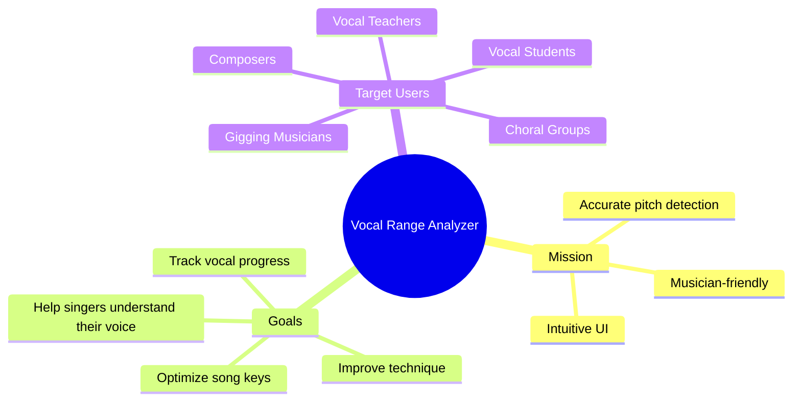
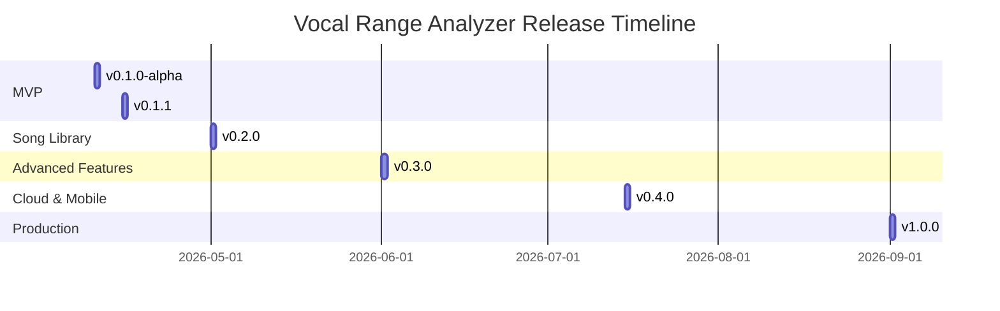

# Project Roadmap & TODO

*Last Updated: 2026-04-10*
*Current Version: 0.1.0-alpha*
*Author: eng-james-o*

---

## 🎯 Vision Statement

To create the most accurate, intuitive, and musician-friendly vocal range analyzer that helps singers of all levels understand, track, and optimize their vocal capabilities.

---

## 🗺️ Release Roadmap

---

## 📊 Current Status

### Completed ✅

- [x] Core YIN algorithm implementation for pitch detection
- [x] Movable-Do solfa conversion logic
- [x] Basic range tracking with statistical outlier rejection
- [x] Modern PySide6/QML GUI bridge and layout
- [x] Real-time pitch display with note and solfa notation
- [x] Audio capture with sounddevice backend
- [x] Comprehensive documentation suite (PRD, User Workflow, Data Models)
- [x] Project setup (CONTRIBUTING.md, requirements.txt)
- [x] Initial UI components (PitchDisplay, RangeDisplay, TonicControls, GainMeter)

### In Progress 🔄

- [ ] **Code Review & Optimization** (See [docs/REVIEW_AND_OPTIMIZATIONS.md](docs/REVIEW_AND_OPTIMIZATIONS.md))
  - [ ] Add comprehensive unit tests
  - [ ] Fix thread safety issues
  - [ ] Optimize YIN algorithm performance
  - [ ] Implement circular buffer for RangeTracker

---

## 🚀 Release Roadmap

### v0.1.1 (Stability Release) - Target: 2026-04-15

**Theme**: "Make it Solid"

**Goal**: Address critical issues and improve reliability for first public alpha.

#### Features & Improvements

- [ ] Add comprehensive unit tests for core modules (80%+ coverage)
- [ ] Fix thread safety issues in CoreBridge
- [ ] Add error handling for audio capture and processing
- [ ] Implement circular buffer in RangeTracker to prevent memory leaks
- [ ] Add loading states and error messages to UI
- [ ] Improve gain meter with logarithmic scale and clipping indicator
- [ ] Add microphone device selection dropdown
- [ ] Implement session reset confirmation dialog

#### Technical Tasks

- [ ] Set up pytest with coverage reporting
- [ ] Configure flake8 and mypy for code quality
- [ ] Create GitHub Actions CI/CD pipeline
- [ ] Add pre-commit hooks for formatting and linting
- [ ] Create test fixtures for audio processing

#### Documentation

- [ ] Update CHANGELOG.md with v0.1.1 changes
- [ ] Add API documentation (docs/api.md)
- [ ] Create Architecture Decision Records (ADRs)

#### Success Metrics

- Test coverage: 80%+
- No critical bugs in core functionality
- Stable audio processing without crashes
- Clean code quality checks passing

---

### v0.2.0 (Song Library) - Target: 2026-05-01

**Theme**: "Make it Useful"

**Goal**: Help users apply their range to real music with song analysis and key recommendations.

#### Features & Improvements

- [ ] **Song Profile Management**
  - [ ] Add song database (SQLite) for storing favorite songs
  - [ ] Parse MIDI files to extract song range
  - [ ] Manual song range entry form
  - [ ] Song tagging and categorization

- [ ] **Enhanced Key Advisor**
  - [ ] Weighted key recommendation strategies (center, high, low)
  - [ ] Multiple song analysis for setlist optimization
  - [ ] Comfort zone visualization
  - [ ] Warning system for out-of-range notes

- [ ] **Session Management**
  - [ ] Save/load vocal range sessions
  - [ ] Session naming and notes
  - [ ] Session history browser
  - [ ] Export session data (JSON)

- [ ] **UI Enhancements**
  - [ ] Vocal range visualization (piano keyboard)
  - [ ] Song library browser
  - [ ] Key recommendation display
  - [ ] Session comparison view

#### Technical Tasks

- [ ] Implement SQLite database layer
- [ ] Add MIDI file parsing (using music21 or mido)
- [ ] Create session persistence system
- [ ] Optimize KeyAdvisor for multiple song analysis
- [ ] Add data export functionality

#### Documentation

- [ ] Update user workflow with song library usage
- [ ] Add data export guide
- [ ] Create setlist optimization tutorial

#### Success Metrics

- Users can analyze and store 10+ songs
- Key recommendations accurate within +/- 2 semitones
- Session data persists across app restarts
- Test coverage: 90%+

---

### v0.3.0 (Advanced Features) - Target: 2026-06-01

**Theme**: "Make it Powerful"

**Goal**: Add advanced features for professional musicians and vocal coaches.

#### Features & Improvements

- [ ] **Setlist Optimizer**
  - [ ] Minimize key changes across setlist
  - [ ] Balance vocal strain across performance
  - [ ] Time-based setlist planning (2-hour sets)
  - [ ] Export optimized setlist with transpositions

- [ ] **Advanced Analytics**
  - [ ] Vocal range progress tracking over time
  - [ ] Pitch accuracy statistics
  - [ ] Vibrato analysis
  - [ ] Tone quality metrics

- [ ] **Collaboration Features**
  - [ ] Share sessions with vocal coaches
  - [ ] Compare ranges with other singers
  - [ ] Ensemble range compatibility checker

- [ ] **Import/Export**
  - [ ] PDF export for session summaries
  - [ ] CSV export for data analysis
  - [ ] Import from other vocal analysis tools

#### Technical Tasks

- [ ] Implement setlist optimization algorithms
- [ ] Add historical data tracking
- [ ] Create collaboration/sharing system
- [ ] Implement PDF generation
- [ ] Add data import functionality

#### Documentation

- [ ] Create advanced usage guide
- [ ] Add collaboration workflow documentation
- [ ] Create data export tutorials

#### Success Metrics

- Setlist optimizer reduces key changes by 50%+
- Historical tracking shows vocal progress over 3+ months
- PDF exports are print-ready and professional

---

### v0.4.0 (Cloud & Mobile) - Target: 2026-07-15

**Theme**: "Make it Accessible"

**Goal**: Enable cross-device access and mobile usage.

#### Features & Improvements

- [ ] **Cloud Sync**
  - [ ] Sync vocal range data to cloud
  - [ ] Cross-device session access
  - [ ] Progress charts and analytics dashboard
  - [ ] Backup and restore functionality

- [ ] **Mobile Companion App**
  - [ ] Lite version for iOS/Android
  - [ ] Stage-friendly interface
  - [ ] Quick tonic calibration
  - [ ] Real-time pitch monitoring

- [ ] **Web Dashboard**
  - [ ] View vocal progress online
  - [ ] Share achievements on social media
  - [ ] Compare with community averages

#### Technical Tasks

- [ ] Design cloud API (REST or GraphQL)
- [ ] Implement authentication system
- [ ] Create mobile app architecture
- [ ] Set up cloud infrastructure
- [ ] Implement data synchronization

#### Documentation

- [ ] Create cloud setup guide
- [ ] Add mobile app documentation
- [ ] Create API documentation

#### Success Metrics

- Cloud sync works across 3+ devices
- Mobile app available on both iOS and Android
- Web dashboard loads in < 2 seconds

---

### v1.0.0 (Production Ready) - Target: 2026-09-01

**Theme**: "Make it Perfect"

**Goal**: Polish all features and prepare for production release.

#### Features & Improvements

- [ ] **Performance Optimization**
  - [ ] Optimize for low-power devices (Raspberry Pi)
  - [ ] Reduce latency to < 30ms
  - [ ] Minimize memory usage
  - [ ] Add performance monitoring

- [ ] **Polish & UX**
  - [ ] Complete UI redesign with professional styling
  - [ ] Add accessibility features
  - [ ] Implement keyboard shortcuts
  - [ ] Add tooltips and help system

- [ ] **Platform Support**
  - [ ] Windows installer
  - [ ] macOS application bundle
  - [ ] Linux packages (Debian, Ubuntu, Fedora)
  - [ ] Docker container for server deployments

- [ ] **Quality Assurance**
  - [ ] Comprehensive test suite (95%+ coverage)
  - [ ] Performance benchmarks
  - [ ] User acceptance testing
  - [ ] Beta testing program

#### Technical Tasks

- [ ] Profile and optimize critical paths
- [ ] Implement platform-specific builds
- [ ] Create installation packages
- [ ] Set up error tracking (Sentry)
- [ ] Implement analytics (optional, opt-in)

#### Documentation

- [ ] Complete user manual
- [ ] Create video tutorials
- [ ] Add troubleshooting guide
- [ ] Create FAQ

#### Success Metrics

- All critical bugs resolved
- Performance meets all targets
- Professional-quality UI/UX
- Available on all major platforms

---

## 🌟 Future Vision (v2.0.0+)

### v2.0.0 (AI-Powered) - Target: 2027-Q1

- [ ] **AI-Powered Features**
  - [ ] Automatic vocal technique suggestions
  - [ ] Style analysis and recommendations
  - [ ] Personalized exercises based on range
  - [ ] AI-backed pitch correction suggestions

- [ ] **Integration**
  - [ ] DAW plugin (VST3, AU)
  - [ ] Integration with popular music software
  - [ ] API for third-party integrations
  - [ ] Webhook support for automation

- [ ] **Community Features**
  - [ ] Vocal range leaderboards (opt-in)
  - [ ] Community challenges
  - [ ] Vocal coach marketplace
  - [ ] User-generated content sharing

### v3.0.0 (Platform Expansion) - Target: 2027-Q3

- [ ] **Hardware Integration**
  - [ ] Dedicated hardware device
  - [ ] IoT vocal monitor
  - [ ] Wearable integration

- [ ] **Educational Features**
  - [ ] Interactive vocal lessons
  - [ ] Ear training integration
  - [ ] Music theory education
  - [ ] Certified vocal coach program

---

## 📋 Technical Debt Backlog

### High Priority

- [ ] Replace `sounddevice` with more robust platform-native backends if latency persists
- [ ] Optimize YIN performance for low-power devices (Raspberry Pi support)
- [ ] Expand unit test coverage to 90%+
- [ ] Internationalization (i18n) for Solfa syllables (e.g., Fixed-Do locales)

### Medium Priority

- [ ] Refactor CoreBridge to reduce responsibilities
- [ ] Implement proper dependency injection
- [ ] Add comprehensive logging system
- [ ] Implement configuration management (settings file)
- [ ] Add plugin architecture for extensibility

### Low Priority

- [ ] Migrate from PySide6 to PySide7 when stable
- [ ] Consider alternative audio backends (PortAudio, JACK)
- [ ] Evaluate alternative pitch detection algorithms
- [ ] Explore GPU acceleration for audio processing

---

## 🎯 Sprint Planning

### Current Sprint: v0.1.1 Stability (2026-04-10 to 2026-04-15)

**Sprint Goal**: Address critical issues and improve code quality

**Sprint Backlog**:

1. **Day 1-2**: Add unit tests for core modules
   - [ ] Test PitchDetector
   - [ ] Test NoteConverter
   - [ ] Test RangeTracker
   - [ ] Test KeyAdvisor

2. **Day 3**: Fix thread safety and error handling
   - [ ] Add QMutex to CoreBridge
   - [ ] Add try/catch blocks to audio processing
   - [ ] Implement proper error messages

3. **Day 4**: Implement circular buffer and optimizations
   - [ ] Add circular buffer to RangeTracker
   - [ ] Optimize Solfa conversion
   - [ ] Add buffer pooling to AudioCapture

4. **Day 5**: UI improvements and CI/CD
   - [ ] Add loading states
   - [ ] Improve gain meter
   - [ ] Set up GitHub Actions
   - [ ] Configure pre-commit hooks

**Sprint Review**: 2026-04-15
**Sprint Retrospective**: 2026-04-15

---

## 📊 Success Metrics Dashboard

| Metric | Current | Target v0.1.1 | Target v0.2.0 | Target v1.0.0 |
|--------|---------|--------------|--------------|--------------|
| Test Coverage | 0% | 80% | 90% | 95% |
| Code Quality Score | N/A | 8/10 | 9/10 | 10/10 |
| Performance (Latency) | ~30ms | < 25ms | < 20ms | < 15ms |
| Memory Usage | Unbounded | < 85MB | < 80MB | < 75MB |
| User Satisfaction | N/A | 4/5 | 4.5/5 | 5/5 |
| Active Users | 0 | 10+ | 100+ | 1000+ |

---

## 🤝 Contribution Guidelines

### How to Contribute

1. **Pick an Issue**: Choose from the TODO list or GitHub issues
2. **Create a Branch**: Use `feat/`, `fix/`, or `docs/` prefix
3. **Implement**: Follow coding standards and write tests
4. **Test**: Ensure all tests pass and new tests are added
5. **Document**: Update relevant documentation
6. **Submit PR**: Follow PR template and request review

### Good First Issues

- [ ] Add unit tests for existing modules
- [ ] Improve documentation
- [ ] Fix typos and minor bugs
- [ ] Add tooltips to UI elements
- [ ] Create code examples

### Mentorship

- Join our Discord/Slack for help
- Attend weekly office hours
- Read our CONTRIBUTING.md guide

---

## 📝 Changelog

See [CHANGELOG.md](CHANGELOG.md) for detailed release notes.

---

## 🔗 Related Documents

- [Product Requirements Document (PRD)](docs/prd.md)
- [User Workflows](docs/user-workflow.md)
- [Data Models & Architecture](docs/data-models.md)
- [Code Review & Optimizations](docs/REVIEW_AND_OPTIMIZATIONS.md)
- [Contributing Guide](CONTRIBUTING.md)
- [Changelog](CHANGELOG.md)

---

*"A journey of a thousand miles begins with a single note."*

*Last updated: 2026-04-10*
*Next review: 2026-04-15 (End of v0.1.1 sprint)*
