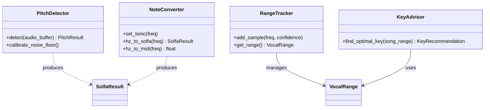
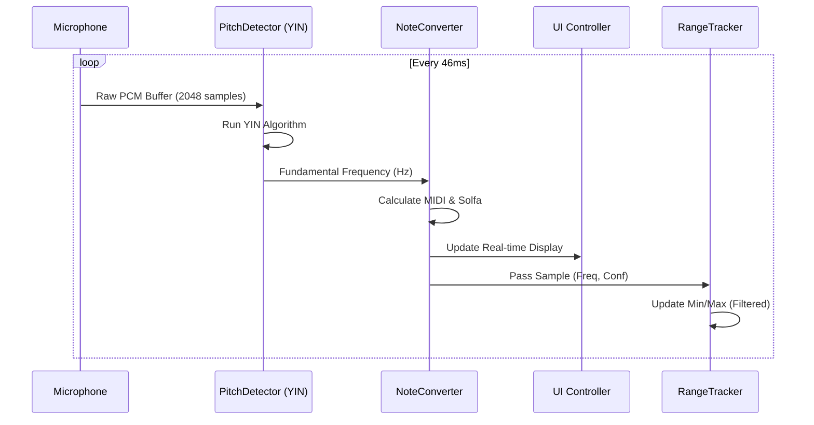

# Data Models & System Architecture

This document details the core data structures and interaction patterns used in the Vocal Range Analyzer.

## 1. Core Data Models

### 1.1 `VocalRange`

Tracks the statistical boundaries of a singer's voice.

```python
@dataclass
class VocalRange:
    min_freq: float           # Absolute minimum frequency (Hz)
    max_freq: float           # Absolute maximum frequency (Hz)
    min_note_name: str        # Scientific pitch notation (e.g., "C3")
    max_note_name: str        # Scientific pitch notation (e.g., "G4")
    measured_at: datetime     # Timestamp of session
    confidence: float         # Aggregated confidence score (0.0 - 1.0)
```

### 1.2 `SolfaResult`

Represents a pitch relative to a user-defined tonic (DOH).

```python
@dataclass
class SolfaResult:
    syllable: str             # "Do", "Re", "Mi", etc.
    octave: int               # Octave relative to the tonic
    cents_deviation: float    # Pitch error in cents (-50 to +50)
    chromatic_variant: str    # e.g., "Di" for sharped Do
```

### 1.3 `KeyRecommendation`

Output from the `KeyAdvisor` when analyzing a song.

```python
@dataclass
class KeyRecommendation:
    semitone_shift: int       # Transposition value
    confidence_score: float   # How well the song fits the range (0-100)
    comfort_low: float        # Low-end comfort rating
    comfort_high: float       # High-end comfort rating
```

## 2. Class Relationships



## 3. Data Flow: From Audio to Insight

The following sequence diagram illustrates the real-time processing loop.



## 4. Signal Processing Chain

1. **Windowing**: Hanning window applied to audio buffers.
2. **Difference Function**: Core of YIN to find periodicity.
3. **Thresholding**: Pick first local minimum below threshold (usually 0.1-0.15).
4. **Parabolic Interpolation**: Refine frequency estimate between samples.
