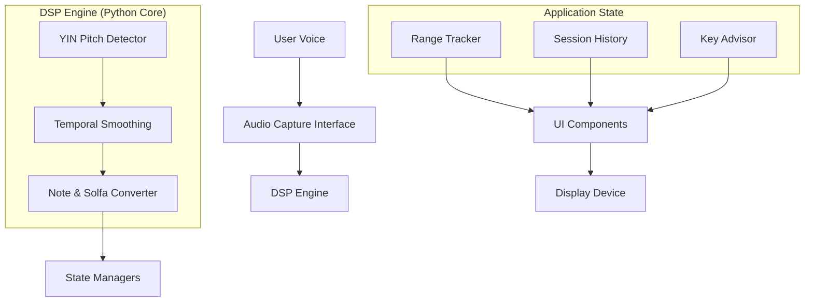

# Product Requirements Document (PRD) - Vocal Range Analyzer

## 1. Executive Summary
**Vocal Range Analyzer** is a specialized tool designed for vocalists to scientifically measure, track, and optimize their musical performance based on their physiological capabilities. It translates raw audio data into actionable musical insights using industry-standard algorithms.

## 2. Target Audience
- **Vocal Students & Teachers**: For progress tracking and technique validation.
- **Choral Groups**: For effective section assignment (Soprano, Alto, Tenor, Bass).
- **Pro/Semi-Pro Gigging Musicians**: For setlist optimization and key selection.
- **Composers & Arrangers**: To understand the range of their vocalists before writing.

## 3. Core Features & Requirements

### 3.1 Pitch Detection & Analysis
- **Requirement**: Use the YIN algorithm for robust fundamental frequency detection in noisy environments.
- **Accuracy**: Detection within ±5 cents at 44.1kHz.
- **Stability**: Implement smoothing (Median filters) to handle vibrato.

### 3.2 Musical Notation (Solfa)
- **Requirement**: Support **Movable-Do Solfa**.
- **Calibration**: User must be able to "sing their DOH" to establish a tonic.
- **Display**: Real-time conversion of Hz to Solfa syllables (Do, Re, Mi, etc.).

### 3.3 Vocal Range Mapping
- **Requirement**: Track absolute minimum and maximum frequencies.
- **Statistical Filtering**: Remove outliers (instantaneous spikes) and require sustained tone duration (min 200ms).
- **Metric**: Display results in both Hz and Scientific Pitch Notation (e.g., A2 - C5).

### 3.4 Key & Setlist Advisory
- **Requirement**: Recommend optimal transpositions for songs based on a singer's comfort zone.
- **Setlist Mode**: Balance keys across multiple songs to minimize vocal fatigue.

## 4. System Architecture

## 5. Technical Requirements
- **Runtime**: Python 3.9+
- **Audio Backend**: PortAudio (via sounddevice)
- **Theory Lib**: Music21
- **Latency**: End-to-end latency < 100ms for "live feel".

## 6. Future Roadmap
- Cloud synchronization for long-term progress charts.
- MIDI export of session range data.
- VST version for integration with DAWs.
