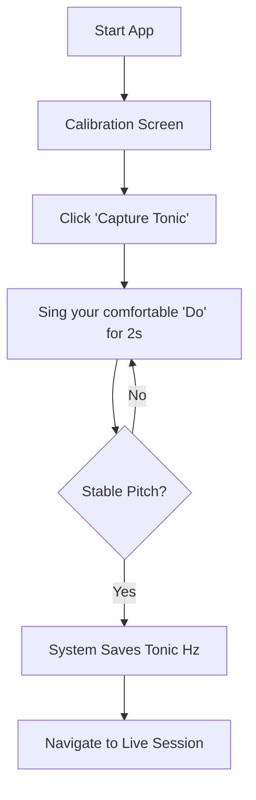
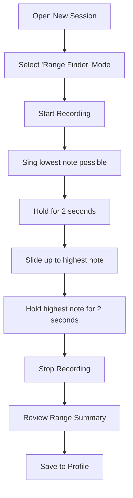
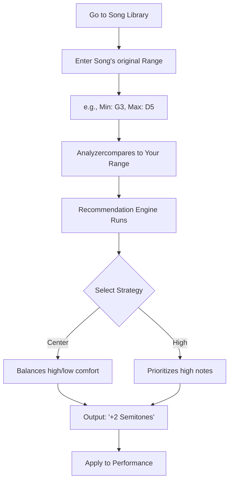

# User Workflows

This guide walks you through the primary use cases of the Vocal Range Analyzer.

## 1. Initial Calibration (Set Your DOH)

Before any session, you must calibrate the system to your "tonic" or "DOH". This allows the analyzer to display your pitch in relative solfa notation.

**Tip**: Choose a pitch that feels like your "home" note for the day. For most beginners, this is near the bottom of their middle register.

## 2. Measuring Your Vocal Range

The Range Finder track your highest and lowest successfully sustained notes.

**Important**: The system filters out quick spikes and breath noise. Ensure you *sustain* the note for the counter to register it.

## 3. Finding the Optimal Key for a Song

Use this workflow to transpose a song into your most comfortable register.

## 4. Troubleshooting Workflow

If you encounter "No Pitch Detected":
1.  **Check Hardware**: Is the mic selected in settings?
2.  **Environment**: Is there too much background noise?
3.  **Tonic Adjustment**: If Solfa feels "off", recalibrate your DOH.
4.  **Gain**: Ensure your input level isn't clipping (turning red).
